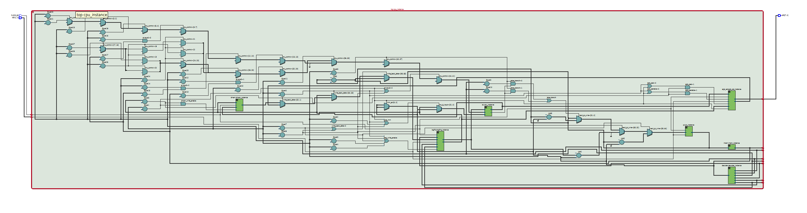
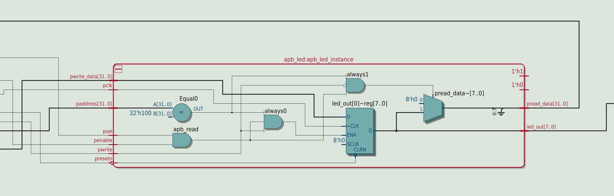
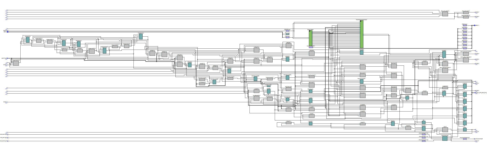
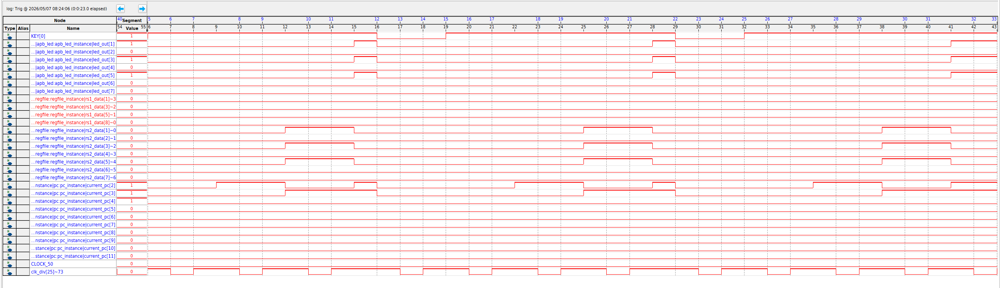
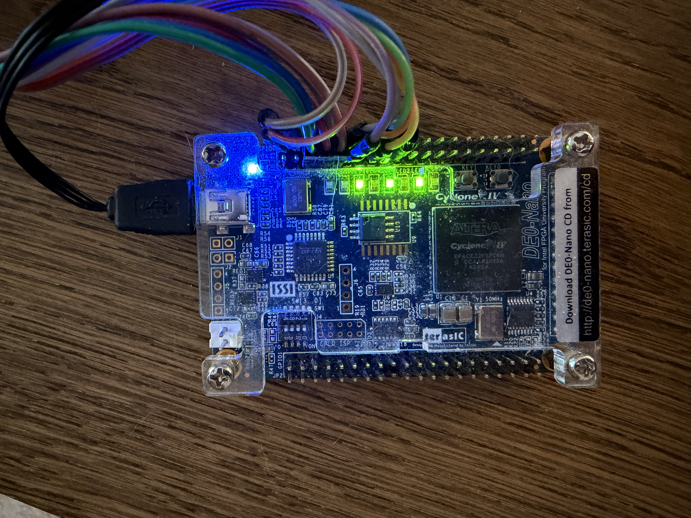

I built this project because I want to understand how a CPU works at a low level by desinging one myself from scratch and used LLMs such as Claude, GPT and Gemini and other references (see in reference section) to verify architecture, learning, reviewing RTL, debugging and improving documenations. Not only that but in this project I also want to experince how can agentic AI tools can support or play roles in silicon development tasks.

Hardware development:
- Designing RTL modules,
- Connecting them into a working datapath
- Verifying functionally through simulation
- Running lint and synthesis

Agentic AI and automation workflows:
- CI regression triage,
- RTL review
- Verification gap analysis
- Automated bug fix

After the verification stage, the CPU will implemented on DE0-nano FPGA board with a Cyclone® IV EP4CE22F17C6N FPGA to validate that the RTL works on real physical hardware.

## CPU Design

### Architecture

This CPU follows a **single-cycle architecture**, meaning each instruction is fetched, decoded, executed, accesses memory if needed, and writes back its result in one clock cycle.

The design is intentionally simple and modular so that each part of the CPU datapath can be studied, tested, and extended independently.

### Main RTL Blocks

- **PC (`pc.sv`)**  
  Holds the current instruction address.

- **Instruction Memory (`imem.sv`)**  
  Stores the program as a `.hex` file loaded into ROM.

- **Decoder (`decoder.sv`)**  
  Extracts `opcode`, `rd`, `rs1`, `rs2`, `funct3`, and `funct7` from the instruction.

- **Register File (`regfile.sv`)**  
  Implements 32 general-purpose RISC-V registers.

- **ALU (`alu.sv`)**  
  Executes arithmetic and logic operations.

- **Data Memory (`dmem.sv`)**  
  Supports load and store instructions.

- **Top Module (`top.sv`)**  
  Integrates all RTL blocks and contains the main control logic.

- **APB-Style LED Peripheral (`apb_led.sv`)**  
  Allows the CPU to control LEDs through a memory-mapped APB-style peripheral.

---

## Implemented Features

### Arithmetic and Logic

- `add`
- `sub`
- `addi`
- `and`
- `or`
- `xor`
- `mul`
- `slt`

### Memory

- `lw`
- `sw`

### Control Flow

- `beq`
- `bne`
- `jal`
- `jalr`

### Peripheral Access

- Memory-mapped LED output
- APB-style LED peripheral

> Note: It does not yet implement the full RV32I instruction set.


## CPU Architecture Diagram


## RTL Viewer / Netlist

The following images show the RTL structure and synthesized netlist view of the design.

<p align="center">
  
</p>
<p align="center">
  
</p>

<p align="center">
  
</p>


## Verification

Verification is one of the most important parts of hardware development. It helps determine whether the RTL behaves as intended before moving to FPGA or ASIC implementation.

This project uses several verification methods.

### Verification Methods

- Self-checking SystemVerilog testbench
- ALU unit testbench
- Selected RISC-V compliance-style directed tests
- Verilator linting
- Yosys synthesis checks
- GitHub Actions CI pipeline
- AI-assisted regression triage and RTL review

### Verified Behavior

The verification flow checks the following behavior:

- Reset behavior
- Register writeback
- Register `x0` remains hardwired to zero
- ALU arithmetic and logic behavior
- Load/store correctness
- Memory-mapped peripheral behavior
- APB-style peripheral behavior
- Control-flow instructions:
  - `beq`
  - `bne`
  - `jal`
  - `jalr`


## Simulation

Simulation is used to verify the CPU before FPGA implementation. The testbench runs programs from `.hex` files and checks the final register, memory, and peripheral states. The default simulation verifies APB-style LED write and readback behavior.

```text
PC 0x08: sw x2, 0(x1)
apb_psel=1 apb_penable=1 apb_pwrite=1 apb_paddr=00000100

PC 0x0c: lw x3, 0(x1)
apb_psel=1 apb_penable=1 apb_pwrite=0 apb_pread_data=42 write_back=42

Result:
x3 = 42
led_out = 42
```
This proves that our chip is workign as intended.

## SignalTap / On-Chip Verification

After FPGA bring up, SignalTap can be used to inspect internal signals directly on hardware. For SignalTap testing purpose, the clk signal has been sampling down from 50MHz to around 0.75Hz.

<p align="center">
  
</p>

As LED lighted as what we programmed it to do (00101010), and you can also see that everytime we pressed reset (KEY[0]), the cpu will stop sending signal and turn off LED until it gets trigger signal from cpu to turn on the LED again. rs2_data bits is showing 42 

## FPGA Implementation

The CPU is being implemented on a DE0-Nano FPGA board to validate that the RTL works on physical hardware.

The FPGA demo runs the CPU on the board and demonstrates that a program can write to a memory-mapped / APB-style LED peripheral and drive the physical LEDs.

### FPGA Board

- Board: DE0-Nano
- FPGA: Cyclone IV EP4CE22F17C6N
- Tool: Intel Quartus Prime Lite
- Output peripheral: On-board LEDs

### Planned FPGA Flow

```text
SystemVerilog RTL
        ↓
Quartus Prime Lite synthesis
        ↓
Place-and-route
        ↓
SOF bitstream generation
        ↓
DE0-Nano FPGA programming
        ↓
Physical LED output verification
```

### FPGA Demo Goal

The demonstration program performs the following:

1. Loads the LED peripheral address `0x100`
2. Loads a value such as `42`
3. Stores the value to the APB-style LED peripheral
4. Drives the physical FPGA board LEDs

Expected LED output:

```text
42 decimal = 8'b0010_1010
```

### FPGA board (demo)

As you can see in the picture below, it shows that on-board LED is lighted as what we programmed (00101010).
<p>
  
</p>

## AI-Assisted RTL Workflow

AI is becoming increasingly useful in everyday life and engineering workflows. So I was curious on how we can use AI agents or agentic AI tools to help automate development tasks in hardware design so in this project, I explored how agentic AI tools can support RTL design and verification tasks.

### Current AI Agent Roles

- **CI Regression Triage Agent**  
  Analyzes simulation, compile, lint, synthesis, and RISC-V test logs.

- **RTL Review Agent**  
  Reviews RTL for design issues, style problems, wiring mistakes, missing checks, and synthesis risks.

- **Testbench / Verification Gap Agent**  
  Suggests missing tests and verification improvements.


## Agentic AI Flow

The agentic AI flow works as follows:

```text
Regression logs are generated
        ↓
AI agent reads simulation, lint, synthesis, and RISC-V test logs
        ↓
AI agent can inspect relevant SystemVerilog source files
        ↓
AI agent identifies likely root causes
        ↓
AI agent writes a structured report
        ↓
Optional local repair mode can apply a small fix
        ↓
Regression is rerun to check whether the fix worked
```

This makes the AI workflow more than a simple chatbot. The agent can use tools to inspect project files and, in controlled local repair mode, can attempt small patches.


## Regression Triage Agent

When logs such as the following are generated:

- `sim_log.txt`
- `compile_log.txt`
- `lint_log.txt`
- `synth_log.txt`
- `riscv_tests/*.log`

the triage agent reviews them and summarizes whether each stage passed or failed.

For example, it can report:

```text
COMPILE PASS
DEFAULT SIM PASS
RISCV TESTS PASS
ALU UNIT TEST PASS
SYNTH PASS
LINT FAIL
```

If a stage fails, the agent explains the likely cause and suggests how to fix it.

This saves time because the agent can point to the most important failure instead of requiring every log to be inspected manually.


## RTL Source Inspection and Design Review

The RTL review agent can inspect SystemVerilog source files and identify design risks such as:

- Unused signals
- Missing port connections
- Wrong signal widths
- Implicit wires
- Incorrect ALU control mapping
- Wrong branch or jump PC logic
- Unverified instruction behavior
- Simulation-only coding style
- FPGA-unfriendly memory style

For example, the agent may catch an issue such as:

```text
apb_led led_out is not connected to the top-level led_out signal.
```

This is useful because hardware bugs are often caused by wiring mistakes, control-signal mistakes, missing checks, or incomplete verification.

## Verification Gap Agent

The verification gap agent helps identify what the current tests do not cover yet.

For example, it may suggest adding tests for:

- More immediate-value edge cases
- Negative signed comparisons
- Back-to-back instruction dependencies
- Unsupported instruction behavior
- More APB protocol scenarios
- FPGA SignalTap validation
- Constrained-random instruction testing
- Functional coverage

This helps improve the verification plan over time.


## Optional Repair Mode

Local repair mode can be enabled with:

```bash
AUTO_REPAIR=1 python3 tools/ai_agent/run_agents.py
```

In this mode, the AI agent can:

- Read failing logs
- Read relevant RTL files
- Make a small patch
- Save a backup
- Rerun regression
- Report whether the fix worked

For example, if a syntax error or missing port connection is detected, the agent can attempt a small repair and rerun the regression flow.

> Note: Repair mode is experimental. The AI agent can fix simple issues, but it can also introduce small mistakes. All AI-generated patches must be reviewed and must pass simulation, lint, synthesis, and regression tests before being accepted.

## Report-Only Mode

In CI or safe local analysis mode, the agents can run without modifying RTL files.

```bash
AUTO_REPAIR=0 python3 tools/ai_agent/run_agents.py
```

In report-only mode, the AI agents:

- Run regression analysis
- Read generated logs
- Generate reports
- Summarize failures
- Suggest fixes
- Do not rewrite RTL files

This is the preferred mode for GitHub Actions CI.

## Project Structure

```text
.
├── .github/workflows/      # CI/CD workflows
├── docs/                   # Documentation, diagrams, and images
├── scripts/                # Helper scripts for simulation, logs, and synthesis
├── src/rtl/                # RTL source files
├── tb/                     # SystemVerilog testbenches
├── tests/riscv_comp/       # Selected RISC-V compliance-style directed tests
├── tools/                  # AI agent tooling
└── README.md
```

## Setup

### Required Tools

Install the following tools:

- Icarus Verilog
- Verilator
- Yosys
- Python 3

On Ubuntu / Debian:

```bash
sudo apt-get update
sudo apt-get install -y iverilog verilator yosys python3 python3-pip
```

For FPGA implementation, install:

- Intel Quartus Prime Lite
- Cyclone IV device support
- USB-Blaster driver
- Quartus Programmer


## Running the Verification Flow

Run the full RTL regression flow:

```bash
bash scripts/generate_logs.sh
```

This generates logs under:

```text
reports/
```

The flow checks:

- RTL compilation
- Default simulation
- Selected RISC-V tests
- ALU unit test
- Verilator lint
- Yosys synthesis


## Running the AI Agents

Run the AI agents in report-only mode:

```bash
AUTO_REPAIR=0 python3 tools/ai_agent/run_agents.py
```

Run the AI agents in optional local repair mode:

```bash
AUTO_REPAIR=1 python3 tools/ai_agent/run_agents.py
```

## References and Learning Resources

This project was built as a learning project using official specifications, digital design references, FPGA documentation, tool documentation.

### CPU Architecture and RISC-V

- **RISC-V Unprivileged ISA Specification**  
  Used as the main reference for instruction formats, opcodes, immediates, register fields, and RV32I instruction behavior.  
  https://docs.riscv.org/reference/isa/unpriv/unpriv-index.html

- **RISC-V ISA Manual GitHub Repository**  
  Reference source for the RISC-V instruction set manual and related documentation.  
  https://github.com/riscv/riscv-isa-manual

### Digital Design and SystemVerilog

- **IEEE 1800 SystemVerilog Standard**  
  Reference for SystemVerilog RTL and testbench language semantics.  
  https://standards.ieee.org/ieee/1800/7743/

### Bus and Peripheral Interface

- **Arm AMBA APB Protocol Specification**  
  Used as a reference when designing the APB-style LED peripheral interface.  
  https://developer.arm.com/documentation/ihi0024/b/

- **Arm AMBA Specifications Overview**  
  General reference for AMBA bus protocols such as APB, AHB, and AXI.  
  https://www.arm.com/architecture/system-architectures/amba/amba-specifications

### FPGA Board Documentation

- **Terasic DE0-Nano User Manual and Resources**  
  Used for FPGA board information, pin assignments, LEDs, pushbuttons, clock input, and board-level bring-up.  
  https://www.terasic.com.tw/cgi-bin/page/archive.pl?Language=English&No=593&PartNo=4

### Open-Source EDA Tools

- **Icarus Verilog**  
  Used for RTL simulation.  
  https://steveicarus.github.io/iverilog/

- **Verilator**  
  Used for lint checking.  
  https://verilator.org/

- **Yosys Open SYnthesis Suite**  
  Used for RTL synthesis and netlist generation.  
  https://yosyshq.net/yosys/

## Future Works

- Add constrained-random instruction testing
- Add functional coverage using `covergroup` and `coverpoint`
- Add UVM-lite verification components
- Explore AXI4-Lite peripheral interface
- Expand RISC-V instruction support
- Improve FPGA-friendly memory implementation
- Explore a pipelined CPU architecture (move from single-cycle to multi-cycle, so it behaves more like a real commercial CPU)
- Improve AI-agent repair workflow (instead of letting it run in serial, we can run AI-agents in parallel)
